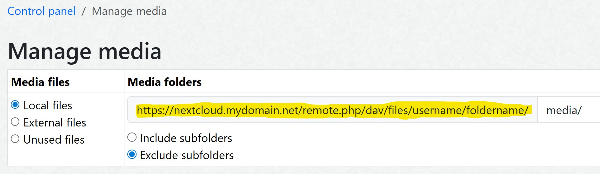

[](https://github.com/Jefferson49/CustomFilesystem/releases/latest)
[](https://webtrees.net/download)

# Custom Fileystem for webtrees
A [webtrees](https://webtrees.net) 2.1/2.2 custom module to create a custom filesystem

##  Table of contents
This README file contains the following main sections:
+   [What are the benefits of this module?](#what-are-the-benefits-of-this-module)
+   [Requirements](#requirements)
+   [Installation](#installation)
+   [Screenshot](#screenshot)
+   [Supported Filesystems](#supported-filesystems)
+   [Configuration of Filesystems](#configuration-of-filesystems)
+   [Translation](#translation)
+   [Bugs and Feature Requests](#bugs-and-feature-requests)
+   [License](#license)
+   [Contributions and Copyrights](#contributions-and-copyrights)
+   [GitHub Repository](#github-repository)

## What are the benefits of this module?
+ Use a different filesystem in webtrees; other than the standard folder on the server, which webtrees selects by default.
+ Use a cloud service (e.g. Nextcloud) to synchronize files between your local computer and a cloud file system. Allow webtrees to access and use the files of this (cloud based) filesystem.

##  Screenshot


## Requirements
+ [webtrees](https://webtrees.net/download): Version 2.1 or greater.
+ [PHP](https://www.php.net/): Version 8.2 or greater.

## Installation
+ Install and use [Custom Module Manager](https://github.com/Jefferson49/CustomModuleManager) for an easy and convenient installation of webtrees custom modules.
+ Open the Custom Module Manager view in webtrees, select "CustomFilesystem", and click on the "Install Module" button.

**Manual installation**:
+ Download the [latest release](https://github.com/Jefferson49/CustomFilesystem/releases/latest) of the module by downloading the "**custom_filesystem_v\*.zip**" file from "Assets". Do not download "Source code.zip".
+ Unzip the downloaded file and copy the included folder "custom_filesystem" into the "module_v4" folder of your webtrees installation
+ Configure the filesystem, see chapter [Configuration of Filesystems](#configuration-of-filesystems).

## Supported Filesystems
+ [Nextcloud](https://nextcloud.com/)

Other filesystems:
+ The concept is based on the [League Flysystem](https://flysystem.thephpleague.com).
+ The concept allows to integrate further filesystem adapters, which are based on the League Flysystem.
+ A list of available adapters is provided in the [documenatation](https://flysystem.thephpleague.com/docs/) of the League Flysystem.
+ You can create a [Github issue](https://github.com/Jefferson49/CustomFilesystem/issues) to propose adding further adapters to the webtrees custom module. 

## Configuration of Filesystems
### Nextcloud
Open your webtrees config.ini.php file and add the following lines (copy/paste to the end):
```PHP
Nextcloud_nextcloudUrl = 'https://nextcloud.MYDOMAIN.net'
Nextcloud_folderName = '<FOLDER_NAME>'
Nextcloud_userName = '<USER_NAME>'
Nextcloud_password = '<PASSWORD>'
```

## Translation
Currently, the following languages are available:
+ English
+ German

You can help to translate this module. The language files are available on [POEditor](https://poeditor.com/projects/view?id=809248), where you can update or add a language.

Alternatively, you can directly edit the .po translation text files, which can be found in [/resources/lang/](resources/lang). You can use a specific editor like [Poedit](https://poedit.net/) or a text editor like notepad++ to work on translations and provide them in the [GitHub repository](https://github.com/Jefferson49/CustomFilesystem) of the module. You can do this via a pull request (if you know how to do), or by opening a new issue and attaching a .po file. 

Updated translations will be included in the next release of this module.

## Bugs and Feature Requests
If you experience any bugs or have a feature request for this webtrees custom module, you can [create a new issue](https://github.com/Jefferson49/CustomFilesystem/issues).

## License
+ [GNU General Public License, Version 3](LICENSE.md)

This program is free software: you can redistribute it and/or modify it under the terms of the GNU General Public License as published by the Free Software Foundation, either version 3 of the License, or (at your option) any later version.

This program is distributed in the hope that it will be useful, but WITHOUT ANY WARRANTY; without even the implied warranty of MERCHANTABILITY or FITNESS FOR A PARTICULAR PURPOSE. See the GNU General Public License for more details.

You should have received a copy of the GNU General Public License along with this program. If not, see https://www.gnu.org/licenses/.

## Contributions and Copyrights
+ webtrees
    + [webtrees](https://webtrees.net): online genealogy
    + Copyright (c) 2025 [webtrees development team](http://webtrees.net)
+ League Flysystem
    + [League\Flysystem](https://github.com/thephpleague/Flysystem)
    + Copyright (c) 2013-2024 Frank de Jonge
+ Flysystem adapter for Nextcloud
    + [flysystem-nextcloud](https://github.com/marktaborosi/flysystem-nextcloud)
    + Copyright (c) 2025 Mark Taborosi
+ Vesta Common (webtrees custom module)
    + [Cissee\WebtreesExt\More18N](https://github.com/vesta-webtrees-2-custom-modules/vesta_common/blob/master/patchedWebtrees/MoreI18N.php)
    + Copyright (c) 2019 – 2025 Richard Cissée

## GitHub Repository
https://github.com/Jefferson49/CustomFilesystem
